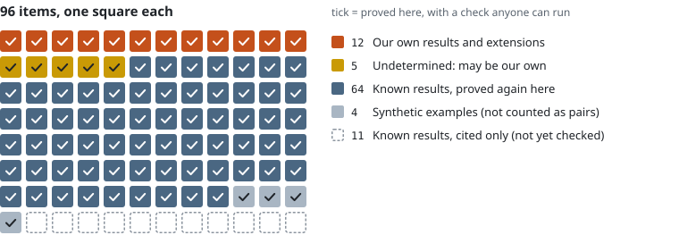
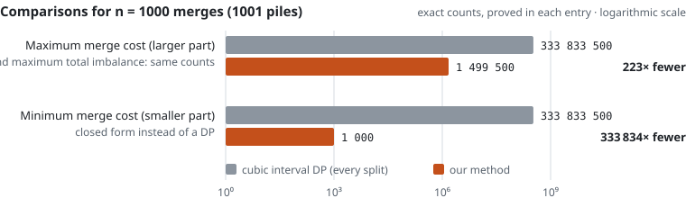
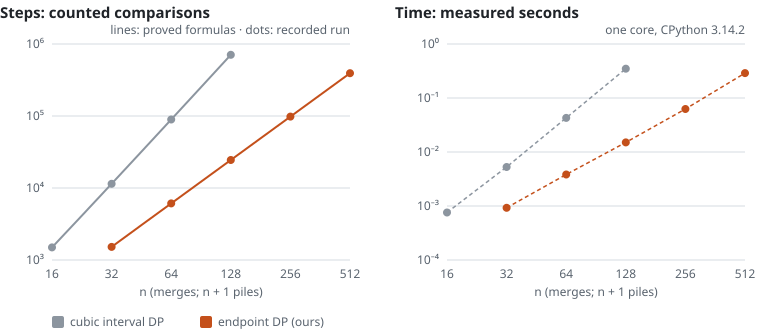
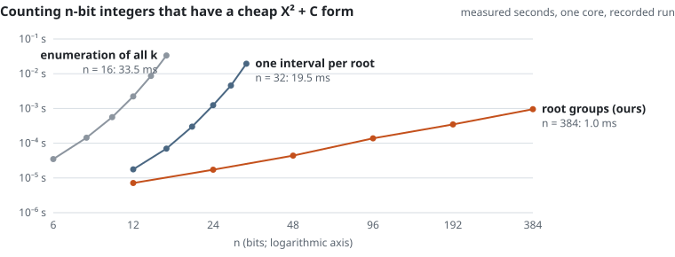
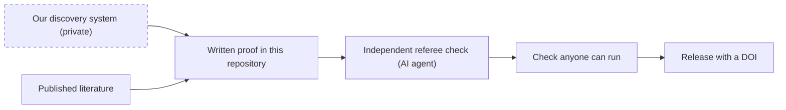

# Complexity Pairs Dataset

[](https://doi.org/10.5281/zenodo.23184028)
[](https://github.com/wbeni95/complexity-pairs-dataset/actions/workflows/validate.yml)
[](LICENSE)
[](LICENSE-DATA)

**Algorithms that do the same job with far less work. Every item marked ✅ has a written proof and a check anyone can run.**

An open dataset of *complexity pairs* (two or more correct algorithms for the same problem whose costs differ
asymptotically) and theorem notes. It is built for engineers who implement, researchers who cite, and algorithm-discovery systems that learn from verified
data.

> [!NOTE]
> **What's new: v0.4.0, 8 October 2026.** Five theorem notes on the balanced tripartitioning tensor P₂ (15 × 15 × 15),
> which links the asymptotic rank conjecture to algorithms for set cover and the permanent. In characteristic 0,
> 26 ≤ border rank ≤ rank ≤ 29; the published bounds were 15 and 31. Also: a general bound for unbalanced
> tripartitions that extends Flavi–Jelisiejew–Michałek, a corrected group construction from a preprint, exact small
> cases, this front page, and CI that checks what a change can affect.

## At a glance

<!-- GLANCE:START -->
<picture>
  <source media="(prefers-color-scheme: dark)" srcset="docs/img/items-dark.svg">
  
</picture>

| Whose result | Pairs and entries | Theorem notes | ✅ Proved here |
|---|---:|---:|---:|
| 🟠 **Our own results and extensions**: not found in the literature we searched | 4 | 13 | 17 of 17 |
| 🟡⏳ **Undetermined**: may be our own; a source that might contain it could not be read | 0 | 5 | 5 of 5 |
| **Known results, proved again here**: our own proofs and checks of published results | 62 | 2 | 64 of 64 |
| **Synthetic examples**: deliberately wasteful rewrites, never counted as pairs | 4 | – | 4 of 4 |
| **Known results, cited only**: waiting in staging, not yet checked | 11 | – | 0 of 11 |
| **Total** | **81** | **20** | **90 of 101** |
<!-- GLANCE:END -->

## What the new results save

Each of our own pair results replaces a slower exact method by a faster one that returns the same answer. The
operation counts are proved exactly in each entry's PROOFS.md; the recorded run measures the same counts and the time
they take.

<picture>
  <source media="(prefers-color-scheme: dark)" srcset="docs/img/comparisons-n1000-dark.svg">
  
</picture>

For a row of n + 1 piles (n merges), the counts are n(n+1)(2n+1)/6 for the cubic interval DP, n(3n−1)/2 for the endpoint DP and n for the closed form,
proved in [pairs/max-merge-cost-larger-part-cubic-dp-vs-endpoint-dp](pairs/max-merge-cost-larger-part-cubic-dp-vs-endpoint-dp),
[pairs/max-merge-imbalance-cubic-dp-vs-endpoint-dp](pairs/max-merge-imbalance-cubic-dp-vs-endpoint-dp) and
[pairs/min-merge-cost-smaller-part-cubic-dp-vs-closed-form](pairs/min-merge-cost-smaller-part-cubic-dp-vs-closed-form).

### Steps and time, side by side

<picture>
  <source media="(prefers-color-scheme: dark)" srcset="docs/img/steps-and-time-dark.svg">
  
</picture>

Steps are the evidence; time is the industry's yardstick, so the recorded run keeps both. On one core in CPython,
n = 1000 merges (1001 piles) would take about 2 min 45 s with the cubic DP and about 1.1 s with the endpoint DP: the proved counts
times the time per comparison measured at the largest n of the
[recorded run](ledger/runs/20261008T085246Z.json) (n = 128 and n = 512).

### Less time, much bigger inputs

<picture>
  <source media="(prefers-color-scheme: dark)" srcset="docs/img/same-time-bigger-inputs-dark.svg">
  
</picture>

Counting the n-bit integers that have a cheap X² + C form
([pairs/square-plus-offset-count-enumeration-vs-intervals-vs-groups](pairs/square-plus-offset-count-enumeration-vs-intervals-vs-groups)):
listing every candidate takes 33.5 ms at n = 16 bits, one interval per root takes 19.5 ms at n = 32, and our
root-group method takes 1.0 ms at n = 384. The proved costs are Θ(2ⁿ), Θ(2^(n/2)) and O(n log n) word operations in the entry's word-RAM model (words of
n + 3 bits).
The chart shows measured seconds only, because each algorithm counts a different unit.

<details>
<summary><b>What that could mean in practice: a worked example with stated assumptions</b></summary>

<br>

This is an illustration, not a measured saving. `python tools/savings_scenario.py` recomputes it, and its options take
your own numbers.

| Assumption | Value | Basis |
|---|---|---|
| Workload | maximum merge cost with n = 1000 merges (1001 piles), 10,000 times a day | example |
| Time per comparison | 493 ns (cubic DP), 736 ns (endpoint DP) | recorded run, CPython, one core |
| Power per busy core | 15 W | assumed |
| Electricity price | $0.15 per kWh | assumed |
| Cooling water | 1.8 L per kWh | assumed |

| Result of the example | Per day | Per year |
|---|---:|---:|
| Compute time saved | 454 core-hours | 165,713 core-hours |
| Energy saved | 6.8 kWh | 2,486 kWh |
| Electricity cost saved | $1.02 | $373 |
| Cooling water saved | 12 L | 4,474 L |

The saving grows linearly with how often the computation runs, and faster than linearly with n. The ratio of comparisons
(223× at n = 1000) does not depend on the language or the machine; only the time per comparison does.

</details>

## Where our results could be used

What is proved is in the third column. The last column is our suggestion, not a tested deployment.

| Area | Result | What is proved | Where it could help |
|---|---|---|---|
| Storage engines and databases | [Maximum merge cost (larger part)](pairs/max-merge-cost-larger-part-cubic-dp-vs-endpoint-dp) and [maximum total imbalance](pairs/max-merge-imbalance-cubic-dp-vs-endpoint-dp) 🟠 Own result | The largest total cost (larger part) or total imbalance over all merge orders of n + 1 adjacent runs, with exactly n(3n−1)/2 comparisons instead of n(n+1)(2n+1)/6. | Stress-testing merge and compaction policies in log-structured storage. |
| | [Minimum merge cost (smaller part)](pairs/min-merge-cost-smaller-part-cubic-dp-vs-closed-form) 🟠 Own result | For n + 1 runs, the optimum is the total size minus the largest run: one pass, exactly n comparisons. | Instant cost prediction for small-into-large merging. |
| | [Endpoint law for split-dependent weights](theorems/endpoint-law-split-dependent-weights) 🟠 Own result | If the split-dependent weights satisfy the note's rotation condition RS3w (proved for both maximum merge costs), the two end splits suffice: Θ(n³) becomes Θ(n²). | Interval DPs of this max form whose weights are proved to satisfy the condition, as the two maximum merge costs are. |
| Data compression | [Exact pruning for LZ77-style parsing with repeat-offset slots](theorems/lz77-repeat-slots-exact-pruning) 🟡⏳ Undetermined | With minimum repeat length at least 2 and static token costs, the DP can drop every state whose cost is at least that of a cheapest state plus an explicit margin; the optimum is kept. | Optimal parsers in LZ77-family compressors that reuse recent offsets. |
| | [State bounds for that parser](theorems/lz77-repeat-slots-state-bounds) 🟡⏳ Undetermined | Bounds on the states of the exact parser: Θ(n^(k+1)) in the worst case for fixed k, and still Θ(n^(k+1)) with the pruning on unbounded integer alphabets (nothing is claimed for fixed alphabets). | Memory planning for optimal parsing. |
| Logistics, networks and scheduling | [Edmonds–Karp makes Θ(n³) reads](theorems/max-flow-random-dense-edmonds-karp-cubic-reads) 🟠 Own result · [Dinic Θ(n²)](theorems/max-flow-random-dense-dinic-short-residual-paths) 🟠 Own extension | On the random dense networks of the max-flow entry, with high probability. | Benchmarks with a proved answer to which max-flow algorithm wins. |
| | [Trivial minimum cut on those networks](theorems/max-flow-random-dense-trivial-min-cut) 🟡⏳ Undetermined | With high probability the maximum flow is the smaller of the capacity out of the source and the capacity into the sink. | A warning for benchmark design: these networks test speed, not difficulty. |
| | [Hungarian method, exact iteration count](theorems/hungarian-exact-iteration-count) 🟠 Own extension | Integer (or exact rational) matrices with non-decreasing rows make the entry's implementation run the most iterations possible. | Ready-made worst-case inputs for testing Hungarian codes that follow the entry's implementation. |
| | [First-match rule prices](theorems/first-match-prices-not-pairwise) 🟡⏳ Undetermined | With at most two matching rules per item the price of a rule order is a sum of pairwise terms; from three on it need not be. | Ordering filter, routing or pricing rules. |
| Compilers and software engineering | [Compressed memo keys](theorems/compressed-memo-keys-evaluation-orders) 🟠 Own result | For the recurrence family of the note: an exact test for when a flag can be dropped from a memo key for every data vector and every evaluation order (the note's order models D and S). | Smaller memo tables in dynamic programs. |
| | [When binary powering is exact](theorems/binary-powering-exactness-in-magmas) 🟠 Own result | A finite test, whenever the powers of x are eventually periodic (for example in every finite magma), for when square-and-multiply returns the left power of x under a non-associative operation. | Fast powering in octonion-like algebras and other custom operations. |
| | [Cheapest X^d + C representation](theorems/power-plus-offset-four-candidates) 🟠 Own result · [counting pair](pairs/square-plus-offset-count-enumeration-vs-intervals-vs-groups) 🟠 Own result | Four candidate roots always suffice for d ≥ 3; for X² + C, counting the n-bit integers with a cheap form drops from Θ(2ⁿ) to O(n log n) word operations (the pair's word-RAM model). | Compact encodings of integer constants. |
| | [Knuth's root window for length weights](theorems/knuth-window-concave-length-weights) 🟡⏳ Undetermined | Knuth's speed-up is exact for concave nondecreasing length weights, under the largest- and the smallest-minimiser tie rules, with the chosen roots in closed form. | Optimal search trees and interval DPs whose weights depend on length only. |
| Scientific computing and cryptography | [Characteristic-2 obstructions in two fast matrix multiplication schemes](theorems/per-term-2-integrality-z-half-schemes) 🟠 Own extension | No term of the pinned ℤ[1/2] ⟨3,3,6;40⟩ scheme, and at least 20 of the 32 terms of the pinned ℤ[1/2] ⟨2,4,5;32⟩ scheme (exactly 20 at best), can be made 2-integral in any equivalent form. | Choosing schemes for arithmetic over GF(2), as in coding theory. |
| Algebraic complexity | [Rank of the 15 × 15 × 15 balanced tripartitioning tensor](theorems/tripartition-tensor-p2-rank-at-most-29) 🟠 Own result · [its border rank](theorems/tripartition-tensor-p2-border-rank-at-least-26) 🟠 Own result | In characteristic 0, 26 ≤ border rank ≤ rank ≤ 29 (published bounds: 15 and 31); the upper bound is an explicit 29-term identity valid in every characteristic ≠ 2. | A certified test case for tensor-decomposition software; a reference point for research on set cover and permanent algorithms. |

## How results get here



Our own results start as candidates from a discovery system that we keep private; the other items come from the cited
literature. A candidate is published only after it has a complete written proof here, has been re-checked step by step
by a separate AI referee with scripts of its own (RL-107, RL-113), and has a deterministic check that exits with an
error if any case it checks fails. You never need the methods to trust a result:
the proof is in the repository and the check runs on your machine. Corrections are made in public, and the
[research log](RESEARCH_LOG.md) keeps every one.

## Check it yourself

```bash
git clone https://github.com/wbeni95/complexity-pairs-dataset
cd complexity-pairs-dataset
pip install -r requirements.txt
python tools/replay_proofs.py                    # every check behind every item marked ✅
python tools/replay_proofs.py max-merge-cost-larger-part-cubic-dp-vs-endpoint-dp   # one item
```

## Work with us

- **Using a result?** Open an issue and tell us where. We help adapt the proof to your setting.
- **Have one of the papers we could not read?** Some results are 🟡⏳ undetermined until a few sources can be checked.
  The list is under [Sources we could not read](#sources-we-could-not-read).
- **Research partners, compute and funding.** We are looking for partners to run the discovery system on larger
  problems. Open an issue titled "Partnership", or contact [@wbeni95](https://github.com/wbeni95).
- **Follow new results:** Watch → Custom → Releases.

## All results

Labels: 🟠 **Own result** / 🟠 **Own extension** mark the project's own results; 🟡⏳ **Undetermined** marks results that are probably our own, where a source that might already contain them could not be read (listed under "Sources we could not read" below); ⏳ **Pending** on a literature item means a detail could not be verified because a source could not be read or identified (see [CONTRIBUTING.md](CONTRIBUTING.md#provenance-labels-whose-result-it-is)).

<!-- PAIRS-TABLE:START -->
**66 validated pairs** (V1+, tagged T1–T5, T8 or T9) · 15 open problems (T6) · 6 quantum query separations in pairs/ (T9) · 11 staged (V0) · 12 with a quantum algorithm (⚛) · 70 entries and 20 theorem notes proved here (✅)

### Verified (`pairs/`, V1+)

| Entry | Type | Level | Algorithms (time: leading bound; exact statement in each entry) |
|---|---|---|---|
| [Counting n-bit integers with a cheap representation X^2 + C: enumeration vs interval sweep vs root groups](pairs/square-plus-offset-count-enumeration-vs-intervals-vs-groups) ✅ Proved · 🟠 Own result | T2+T8 | V2 | enumeration of all k with three candidate roots: Theta(2^n) word operations in the word-RAM model of the entry<br>sweep over one interval per root: Theta(2^(n/2)) word operations in the word-RAM model of the entry<br>root groups of equal bit length: O(n log n) word operations in the word-RAM model of the entry |
| [Worst-case merging of adjacent piles when a merge costs the larger part (max sum of max(L, R)): cubic interval DP vs endpoint DP](pairs/max-merge-cost-larger-part-cubic-dp-vs-endpoint-dp) ✅ Proved · 🟠 Own result | T3 | V2 | cubic interval DP (every split): Theta(n^3) on every input<br>endpoint DP (two candidate splits per row): Theta(n^2) on every input |
| [Worst-case total imbalance of merging adjacent piles (max sum of abs(L - R)): cubic interval DP vs endpoint DP](pairs/max-merge-imbalance-cubic-dp-vs-endpoint-dp) ✅ Proved · 🟠 Own result | T3 | V2 | cubic interval DP (every split): Theta(n^3) on every input<br>endpoint DP (two candidate splits per row): Theta(n^2) on every input |
| [Merging adjacent piles at the cost of the smaller part (min sum of min(L, R)): cubic interval DP vs the closed form S - max s](pairs/min-merge-cost-smaller-part-cubic-dp-vs-closed-form) ✅ Proved · 🟠 Own result | T3 | V2 | cubic interval DP (every split): Theta(n^3) on every input<br>closed form S - max s: Theta(n) on every input |
| [Primality testing: trial division vs AKS](pairs/primality-trial-vs-aks) ✅ Proved | T1 | V1 | trial division: Theta(sqrt(N)) = Theta(2^(n/2)) divisions in the worst case<br>AKS: Õ(n^(21/2)) bit operations when multiplication and division of m-bit integers cost Õ(m) |
| [Assignment problem: permutation enumeration vs the Hungarian method](pairs/assignment-brute-vs-hungarian) ✅ Proved | T2 | V2 | permutation enumeration: Theta(n * n!) under the machine-model assumption on itertools.permutations listed under background<br>Hungarian method (shortest augmenting paths with potentials): O(n^3) worst case |
| [Powering in non-associative Cayley-Dickson algebras (octonions, sedenions, dimension 32): repeated multiplication vs square-and-multiply](pairs/cayley-dickson-powering-repeated-vs-square-multiply) ✅ Proved | T2 | V2 | repeated multiplication: Theta(e) = Theta(2^n) algebra products<br>left-to-right square-and-multiply (binary method): Theta(n) algebra products |
| [Determinant over GF(p): cofactor expansion vs Gaussian elimination](pairs/determinant-cofactor-vs-gaussian) ✅ Proved | T2 | V2 | Laplace (cofactor) expansion: Theta(n!) field operations<br>Gaussian elimination mod p: Theta(n^3) field operations on non-singular input |
| [Edit (Levenshtein) distance: plain recursion vs Wagner-Fischer DP](pairs/edit-distance-brute-vs-dp) ✅ Proved | T2 | V2 | plain recursion: Theta(D(n, n)) = Theta((3 + 2 sqrt 2)^n / sqrt(n))<br>Wagner-Fischer dynamic programming: Theta(n^2) |
| [Fibonacci numbers: naive recursion vs dynamic programming vs fast doubling](pairs/fibonacci-naive-vs-dp) ✅ Proved | T2+T3 | V2 | naive recursion: Theta(phi^n)<br>bottom-up dynamic programming: Theta(n) word operations<br>fast doubling (matrix power): Theta(log n) word operations |
| [Greatest common divisor: trial divisors vs Euclid's algorithm](pairs/gcd-trial-vs-euclid) ✅ Proved | T2 | V2 | trial divisors: Theta(2^n) iterations in the worst case<br>Euclid's algorithm: O(n) division steps |
| [Global minimum cut: all bipartitions vs Stoer-Wagner](pairs/global-min-cut-brute-vs-stoer-wagner) ✅ Proved | T2 | V2 | brute force: Theta(n^2 2^n)<br>Stoer-Wagner (array): Theta(n^3) with plain arrays |
| [Horn-SAT: brute force over all assignments vs linear-time unit propagation](pairs/horn-sat-brute-force-vs-unit-propagation) ✅ Proved | T2 | V2 | brute force over all assignments: O(2^n * (L + 1)) always<br>unit propagation with clause counters (Dowling-Gallier): O(n + L + 1) on every input |
| [Longest common subsequence: subsequence enumeration vs dynamic programming](pairs/lcs-brute-vs-dp) ✅ Proved | T2 | V2 | subsequence enumeration: Theta(2^n n) on every input with |a| = |b| = n<br>dynamic programming: Theta(n^2) |
| [Longest increasing subsequence: subset enumeration vs quadratic DP vs patience sorting](pairs/longest-increasing-subsequence) ✅ Proved | T2+T3 | V2 | subset enumeration: Theta(2^n n) on every input<br>quadratic dynamic programming: Theta(n^2) on every input<br>patience sorting with binary search: O(n (1 + log L)) <= O(n log n) for n >= 2 |
| [Optimal LZ77-style parsing with k repeat-offset slots: enumeration of all parses vs dynamic programming over (position, slot contents)](pairs/lz77-repeat-slots-enumeration-vs-slot-dp) ✅ Proved | T2 | V2 | enumeration of all parses: 2^Theta(n log n) token evaluations in the worst case<br>dynamic programming over (position, slot contents): O(n^(k+2)) relaxations for every input and fixed k |
| [Matrix-chain ordering: plain recursion vs dynamic programming](pairs/matrix-chain-recursion-vs-dp) ✅ Proved | T2 | V2 | plain recursion: Theta(3^n) on every input<br>bottom-up dynamic programming: Theta(n^3) |
| [Interval DP with inclusion-monotone weights (endpoint law; maximum-cost BST): plain recursion vs cubic DP vs endpoint DP](pairs/max-cost-bst-recursion-vs-cubic-dp-vs-endpoint-dp) ✅ Proved | T2+T3 | V2 | plain recursion: Theta(3^n) on every input<br>cubic interval DP (every root): Theta(n^3) on every input<br>endpoint DP (two candidate roots per interval): Theta(n^2) on every input |
| [Maximum-weight independent set on k x n grids with diagonals: exhaustive search vs DP over a path decomposition](pairs/max-weight-independent-set-grid-enumeration-vs-path-decomposition-dp) ✅ Proved | T2 | V2 | exhaustive search over all vertex subsets: Theta(N 2^N) on every input with N = k n >= 1 under the background sort assumption<br>DP over the columns (path decomposition of width 2k-1): Theta(F_{k+2}^2 n) = Theta(phi^(2k) n) word operations for n >= 2 apart from sorting the output set |
| [Minimum spanning tree: edge-subset enumeration vs Kruskal (and Prim)](pairs/minimum-spanning-tree-brute-vs-kruskal) ✅ Proved | T2+T3 | V2 | enumeration of all (n-1)-edge subsets: Theta(n * C(n(n-1)/2, n-1)) = 2^Theta(n log n) under the background assumption on itertools.combinations<br>Kruskal with union-find: Omega(n^2 log n) in the worst case if sorted() is a deterministic comparison sort and O(n^2 log n) if it runs in O(m log m) worst-case time<br>Prim, array version: Theta(n^2) on K_n |
| [Modular exponentiation: repeated multiplication vs square-and-multiply](pairs/modular-exponentiation-repeated-vs-square-multiply) ✅ Proved | T2 | V2 | repeated multiplication: Theta(e) = Theta(2^n) multiplications mod m<br>left-to-right square-and-multiply (binary method): Theta(n) multiplications mod m |
| [Optimal binary search tree: plain recursion vs cubic DP vs Knuth's quadratic DP](pairs/optimal-bst-recursion-vs-dp-vs-knuth) ✅ Proved | T2+T3 | V2 | plain recursion: Theta(3^n) on every input<br>cubic interval DP (every root): Theta(n^3) on every input<br>Knuth's speed-up (monotone roots): Theta(n^2) on every input |
| [Weighted perfect matchings of planar grid graphs (dimers): backtracking enumeration vs Kasteleyn's signed determinant (Bareiss)](pairs/planar-perfect-matchings-enumeration-vs-kasteleyn) ✅ Proved | T2 | V2 | backtracking enumeration of perfect matchings: O(N 2^(N/2)) on every instance<br>Kasteleyn signed determinant with Bareiss fraction-free elimination: Theta(N^3) arithmetic operations |
| [Regular-expression matching: backtracking vs memoised backtracking vs Thompson's NFA simulation](pairs/regex-matching-backtracking-vs-thompson) ✅ Proved | T2 | V2 | backtracking (consume first): Exponential in the worst case<br>memoised backtracking: O((m + 1)(|t| + 1)) subproblems with O(1) work each<br>Thompson's NFA simulation: O((m + 1)(|t| + 1)) |
| [Single-pair shortest path: simple-path enumeration vs Dijkstra](pairs/shortest-path-enumeration-vs-dijkstra) ✅ Proved | T2 | V2 | simple-path enumeration: Theta(n (n-2)!) on every n x n input<br>Dijkstra (array version): Theta(n^2) with an array |
| [Counting spanning trees: edge-subset enumeration vs Kirchhoff's matrix-tree theorem (Bareiss)](pairs/spanning-tree-count-enumeration-vs-kirchhoff) ✅ Proved | T2 | V2 | enumeration of all (n-1)-edge subsets: O(n^2 + n log n C(m, n-1)) under the background itertools assumption and Omega(n^2 + n C(m, n-1))<br>Kirchhoff's matrix-tree theorem with Bareiss fraction-free elimination: Theta(n^3) arithmetic operations |
| [2-SAT: brute force over all assignments vs implication graph + strongly connected components](pairs/two-sat-brute-force-vs-scc) ✅ Proved | T2 | V2 | brute force over all assignments: O(2^n * (m + 1)) always<br>Aspvall-Plass-Tarjan (implication graph + Tarjan SCC): O(n + m) on every input |
| [XOR-SAT and #XOR-SAT: brute force over all assignments vs Gaussian elimination over GF(2)](pairs/xor-sat-brute-force-vs-gaussian-elimination) ✅ Proved | T2 | V2 | brute force over all assignments: O(2^n * (m + 1) * (n + 1)) bit operations and steps always<br>Gaussian elimination over GF(2): O(m n min(m, n) + m + n) bit operations and steps |
| [All-pairs shortest paths on dense digraphs: Bellman-Ford from every source vs Floyd-Warshall](pairs/all-pairs-shortest-paths-bellman-ford-vs-floyd-warshall) ✅ Proved | T3 | V2 | Bellman-Ford from every source: Theta(n^2 m) for m >= 1 edges<br>Floyd-Warshall: Theta(n^3) on every input |
| [Maximum bipartite matching: one augmenting path per vertex (Kuhn) vs Hopcroft-Karp](pairs/bipartite-matching-kuhn-vs-hopcroft-karp) ✅ Proved | T3 | V2 | Kuhn's augmenting paths (one DFS per left vertex): O(V (V + E))<br>Hopcroft-Karp: O((V + E) sqrt(V)) |
| [Boolean matrix multiplication: schoolbook vs Strassen over the integers](pairs/boolean-matrix-multiplication-naive-vs-strassen) ✅ Proved | T3 | V2 | schoolbook (Boolean): Theta(n^3)<br>Strassen over the integers, then threshold: Theta(n^(log2 7)) ~ Theta(n^2.807) arithmetic operations on O(log n)-bit integers |
| [Closest pair of points: brute force vs divide and conquer](pairs/closest-pair-brute-vs-divide-conquer) ✅ Proved | T3 | V2 | all pairs: Theta(n^2)<br>Shamos-Hoey divide and conquer: Theta(n log n) on every input |
| [Element distinctness: all pairs vs sorting](pairs/element-distinctness-pairs-vs-sorting) ✅ Proved | T3 | V2 | all pairs: Theta(n^2) worst case<br>sort, then compare neighbours: Theta(n log n) on every input |
| [Integer multiplication: schoolbook vs Karatsuba](pairs/integer-multiplication-schoolbook-vs-karatsuba) ✅ Proved | T3 | V2 | schoolbook (long) multiplication: Theta(n^2) digit operations<br>Karatsuba: Theta(n^log2(3)) ~ Theta(n^1.585) digit operations |
| [Counting inversions: all pairs vs merge sort](pairs/inversion-counting-quadratic-vs-merge) ✅ Proved | T3 | V2 | all pairs: Theta(n^2)<br>merge-sort counting: Theta(n log n) on every input |
| [Longest palindromic substring: brute force vs expanding around centers vs Manacher](pairs/longest-palindromic-substring) ✅ Proved | T3 | V2 | brute force (test every substring): Theta(n^3) worst case<br>expand around centers: Theta(n + R) where R = sum of the maximal palindrome radii over all centers<br>Manacher's algorithm: Theta(n) on every input |
| [Matrix multiplication: schoolbook vs Strassen](pairs/matrix-multiplication-naive-vs-strassen) ✅ Proved | T3 | V2 | schoolbook: Theta(n^3)<br>Strassen: Theta(n^(log2 7)) ~ Theta(n^2.807) |
| [Maximum flow: Edmonds-Karp vs Dinic](pairs/max-flow-edmonds-karp-vs-dinic) ✅ Proved | T3 | V1 | Edmonds-Karp: O(V E^2) for E >= 1<br>Dinic (blocking flows): O(V^2 E) for E >= 1 |
| [Maximum number of heap orderings of a binary tree (minimum hook product): DP over the root split vs Knuth's root window vs the heap formula](pairs/max-heap-orderings-dp-vs-knuth-window-vs-heap-formula) ✅ Proved | T3 | V2 | dynamic program over the root split: Theta(N^2) on every input<br>Knuth's restricted root window (largest tie rule): Theta(N) on every input<br>heap formula (hook product of the heap-shaped tree): Theta(log N) on every input N >= 2 |
| [Maximum subarray sum: brute force vs running sums vs Kadane's scan](pairs/maximum-subarray) ✅ Proved | T3 | V2 | brute force (sum every subarray): Theta(n^3) on every input<br>running sums: Theta(n^2) on every input<br>Kadane's algorithm (linear scan): Theta(n) |
| [Multi-pattern string matching: naive matching per pattern vs KMP per pattern vs Aho-Corasick](pairs/multi-pattern-matching-naive-vs-aho-corasick) ✅ Proved | T3 | V2 | naive matching per pattern: O(N L) character comparisons<br>Knuth-Morris-Pratt per pattern: Theta(P N + L) time on every input with P >= 1<br>Aho-Corasick: Theta(N + L) character comparisons for P >= 1 and a fixed alphabet of sigma characters |
| [OR convolution (covering product): all index pairs vs zeta and Moebius transforms](pairs/or-convolution-naive-vs-zeta-mobius) ✅ Proved | T3 | V2 | all index pairs (naive): Theta(4^n) = Theta(N^2)<br>zeta transform, pointwise product, Moebius transform: Theta(n * 2^n) = Theta(N log N) |
| [Polynomial multiplication over Z_p: schoolbook vs number-theoretic transform (FFT)](pairs/polynomial-multiplication-naive-vs-ntt) ✅ Proved | T3 | V2 | schoolbook convolution: Theta(n^2) in the worst case<br>number-theoretic transform (Cooley-Tukey over Z_p): Theta(n log n) |
| [Range minimum queries: scanning each range vs a sparse table](pairs/range-minimum-queries-naive-vs-sparse-table) ✅ Proved | T3 | V2 | scan each range: Theta(q + sum of the query lengths)<br>sparse table: Theta(n log n) preprocessing plus O(1) per query |
| [Comparison sorting: insertion sort vs merge sort](pairs/sorting-insertion-vs-merge) ✅ Proved | T3 | V2 | insertion sort: Theta(n + I) where I is the number of inversions<br>merge sort: Theta(n log n) on every input |
| [Exact string matching: naive scan vs Knuth-Morris-Pratt](pairs/string-matching-naive-vs-kmp) ✅ Proved | T3 | V2 | naive matching: Theta(max(n - m + 1, 0) m) character comparisons in the worst case<br>Knuth-Morris-Pratt: Theta(n + m) on every input |
| [Zeta transform (sums over subsets): submask enumeration vs Yates' method](pairs/subset-sum-zeta-transform-naive-vs-yates) ✅ Proved | T3 | V2 | submask enumeration (naive): Theta(3^n) = Theta(N^(log2 3))<br>Yates' method (fast zeta transform): Theta(n * 2^n) = Theta(N log N) |
| [3SUM: all triples vs sorting with two pointers](pairs/three-sum-cubic-vs-quadratic) ✅ Proved | T3 | V2 | all triples: Theta(n^3) worst case<br>sort + two pointers: Theta(n^2) in the worst case |
| [3XOR: all triples vs a Patricia trie (deterministic quadratic)](pairs/three-xor-all-triples-vs-patricia-trie) ✅ Proved | T3 | V2 | all triples: Theta(n^3) in the worst case<br>Patricia trie: O(n^2 + n w) word operations |
| [XOR convolution: all index pairs vs the fast Walsh-Hadamard transform](pairs/xor-convolution-naive-vs-walsh-hadamard) ✅ Proved | T3 | V2 | all index pairs (naive): Theta(4^n) = Theta(N^2)<br>fast Walsh-Hadamard transform (FWHT): Theta(n * 2^n) = Theta(N log N) |
| [NAND-tree evaluation: deterministic 2^h leaf reads vs randomized ((1+sqrt 33)/4)^h expected](pairs/nand-tree-evaluation-deterministic-vs-randomized) ✅ Proved | T4+T3 | V2 | deterministic left-first evaluation: 2^h = N leaf reads in the worst case<br>randomized random-order evaluation: Theta(((1 + sqrt(33))/4)^h) = Theta(N^0.7537) expected leaf reads in the worst case |
| [Primality testing: Miller-Rabin (randomized) vs AKS (deterministic)](pairs/primality-miller-rabin-vs-aks) ✅ Proved | T4 | V1 | Miller-Rabin: O(k n^3) bit operations for k rounds with schoolbook arithmetic<br>AKS: Õ(n^(21/2)) bit operations if multiplication and division of m-bit integers cost Õ(m) |
| [3-SAT: brute force vs Schöning's random walk](pairs/3sat-brute-force-vs-schoening) ✅ Proved | T6+T8 | V1 | brute force: O(2^n m) worst case<br>Schöning's random walk (Monte Carlo, one-sided error): O(T(n) n m) with T(n) = ceil(ln(10^6) / p(n)) = Theta((4/3)^n sqrt(n)) tries |
| [Chromatic number: subset DP over independent sets vs inclusion-exclusion](pairs/chromatic-number-subset-dp-vs-inclusion-exclusion) ✅ Proved | T6+T8 | V2 | subset DP over all independent sets: Theta(3^n) on every input<br>inclusion-exclusion (Bjorklund-Husfeldt-Koivisto): (2 chi(G) + 2) 2^n - 2 arithmetic operations |
| [Ordering a first-match rule list: enumeration of all k! orders vs dynamic programming over subsets of rules](pairs/first-match-rule-ordering-enumeration-vs-subset-dp) ✅ Proved | T6+T8 | V2 | enumeration of all orders: O(k! k m) for k<br>dynamic programming over subsets of rules: Theta(2^k (k + m)) on every input |
| [Counting Hamiltonian cycles: permutation enumeration vs inclusion-exclusion (and the Held-Karp counting DP)](pairs/hamiltonian-cycle-count-enumeration-vs-inclusion-exclusion) ✅ Proved | T6+T8 | V2 | permutation enumeration: Theta(n!) arc tests in the worst case<br>inclusion-exclusion over vertex subsets: Theta(n^3 2^n)<br>Held-Karp counting DP: Theta(n^2 2^n) |
| [0/1 knapsack: subset enumeration vs meet in the middle vs pseudo-polynomial DP](pairs/knapsack-01-brute-vs-dp) ✅ Proved | T6+T8 | V2 | subset enumeration: Theta(2^n n) on every input<br>meet in the middle (Horowitz-Sahni): Theta(2^(n/2) n) in the worst case<br>capacity DP (Bellman): Theta(n W) in the worst case |
| [Linear ordering problem: enumeration of all n! orders vs dynamic programming over subsets](pairs/linear-ordering-enumeration-vs-subset-dp) ✅ Proved | T6+T8 | V2 | enumeration of all orders: Theta(n! n^2) on every input<br>dynamic programming over subsets: Theta(n^2 2^n) on every input |
| [Permanent: sum over permutations vs Ryser's formula](pairs/permanent-naive-vs-ryser) ✅ Proved | T6+T8 | V2 | sum over all permutations: Theta(n * n!) arithmetic operations<br>Ryser's formula with Gray-code ordering: Theta(n 2^n) arithmetic operations |
| [Travelling salesman: permutation enumeration vs Held-Karp DP](pairs/tsp-brute-vs-held-karp) ✅ Proved | T6+T8 | V2 | permutation enumeration: Theta(n!)<br>Held-Karp dynamic programming: Theta(n^2 2^n) on every input |
| [Bernstein-Vazirani: n classical queries vs 1 quantum query](pairs/bernstein-vazirani-classical-vs-quantum) ✅ Proved | T9 | V2 | classical: query the unit vectors: n queries<br>Bernstein-Vazirani quantum algorithm: 1 query ⚛ |
| [Collision problem: Theta(N^(1/2)) classical queries vs O(N^(1/3)) quantum queries (Brassard-Hoyer-Tapp)](pairs/collision-problem-classical-vs-quantum) ✅ Proved | T9 | V2 | classical birthday search: Theta(sqrt N) = Theta(2^(n/2)) queries expected<br>Brassard-Hoyer-Tapp, known number of marked points: Theta(N^(1/3)) = Theta(2^(n/3)) queries expected on every input ⚛<br>Brassard-Hoyer-Tapp with BBHT exponential search (unknown number of marked points): Theta(N^(1/3)) queries expected on every input ⚛ |
| [Deutsch-Jozsa: 2^(n-1)+1 exact classical queries vs 1 exact quantum query (no gap once classical error is allowed)](pairs/deutsch-jozsa-classical-vs-quantum) ✅ Proved | T9 | V2 | classical deterministic: scan until a difference or a majority: 2^(n-1) + 1 queries in the worst case<br>classical randomized, one-sided bounded error (K = 20 random queries): K = 20 queries for every n<br>Deutsch-Jozsa quantum algorithm (one-query version): 1 query ⚛ |
| [Unstructured search: Theta(N) classical queries vs Theta(sqrt N) quantum queries (Grover)](pairs/grover-search-classical-vs-quantum) ✅ Proved | T9 | V2 | classical random-order search: (N + 1) / 2 queries expected = Theta(2^n)<br>Grover's algorithm: (pi/4) sqrt(N) + O(1) = Theta(2^(n/2)) queries expected ⚛ |
| [Minimum finding: N classical queries vs O(sqrt N) quantum queries (Durr-Hoyer, bounded error)](pairs/minimum-finding-classical-vs-quantum) ✅ Proved | T9 | V2 | classical scan: exactly N queries = Theta(2^n)<br>Durr-Hoyer quantum minimum finding: O(sqrt N) queries in expectation ⚛ |
| [Simon's problem: Theta(2^(n/2)) classical queries vs O(n) quantum queries](pairs/simon-classical-vs-quantum) ✅ Proved | T9 | V2 | classical collision search: Theta(2^(n/2)) queries expected<br>Simon's quantum algorithm: O(n) queries ⚛ |

### Staging (`staging/`, V0: cited, not independently checked)

| Entry | Type | Level | Algorithms (time: leading bound; exact statement in each entry) |
|---|---|---|---|
| [Linear programming: simplex vs ellipsoid / interior-point methods](staging/linear-programming-simplex-vs-interior-point) | T1+T6 | V0 | simplex method (Dantzig's pivot rule): exponential in the worst case<br>ellipsoid method: polynomial in n and L<br>interior-point method (Karmarkar): O(n^3.5 L) arithmetic operations |
| [Maximum flow: Edmonds-Karp vs push-relabel vs almost-linear time](staging/max-flow-edmonds-karp-vs-almost-linear) | T3 | V0 | Edmonds-Karp: O(n m^2)<br>push-relabel (Goldberg-Tarjan): O(n m log(n^2 / m)) with dynamic trees<br>almost-linear-time max flow (Chen et al.): m^(1+o(1)) |
| [Recommendation systems: Kerenidis-Prakash quantum algorithm vs Tang's dequantization](staging/recommendation-systems-dequantization) | T5 | V0 | Kerenidis-Prakash quantum recommendation algorithm: poly(k) polylog(mn) ⚛<br>Tang's quantum-inspired classical algorithm: poly(k, 1/eps) polylog(mn) |
| [3-SAT: brute force vs Schöning vs PPSZ](staging/boolean-satisfiability) | T6+T8 | V0 | brute force: O(2^n m)<br>Schöning's random walk: O((4/3)^n poly(n)) expected<br>PPSZ / biased-PPSZ: O(1.308^n) |
| [Discrete logarithm: generic and index-calculus algorithms vs Shor's quantum algorithm](staging/discrete-logarithm) | T6+T9 | V0 | baby-step giant-step: O(sqrt(p)) = O(2^(n/2)) group operations<br>Pollard rho for logarithms: O(sqrt(p)) group operations<br>number field sieve for discrete logs in GF(q): L_q[1/3, (64/9)^(1/3)]<br>Shor's algorithm: polynomial in n ⚛ |
| [Graph isomorphism: moderately exponential vs quasi-polynomial](staging/graph-isomorphism) | T6+T8 | V0 | brute force over permutations: O(n! n^2)<br>Babai-Luks canonical labeling: exp(O(sqrt(n log n)))<br>Babai's quasi-polynomial algorithm: exp((log n)^O(1)) |
| [Integer factoring: classical algorithms vs Shor's quantum algorithm](staging/integer-factoring) | T6+T8 | V0 | trial division: O(2^(n/2))<br>Pollard rho: O(N^(1/4)) = O(2^(n/4)) heuristically<br>general number field sieve (GNFS): exp(((64/9)^(1/3) + o(1)) (ln N)^(1/3) (ln ln N)^(2/3))<br>Shor's algorithm: O(n^3) quantum gates with schoolbook modular arithmetic ⚛ |
| [Linear systems: conjugate gradient vs the HHL quantum algorithm (conjectured exponential speedup, with fine print and low-rank dequantization)](staging/linear-systems-hhl) | T6 | V0 | classical conjugate-gradient-type solver: O(N sqrt(kappa)) for sparse A<br>HHL quantum algorithm: poly(log N, kappa) ⚛<br>quantum-inspired classical algorithm for LOW-RANK A (dequantization; a different input model): O(poly(k, kappa, ||A||_F, 1/eps) polylog(m, n)) for a rank-k m x n matrix |
| [Polynomial identity testing: randomized polynomial vs deterministic (open)](staging/polynomial-identity-testing) | T6+T4 | V0 | expand into monomials: exponential in s in general<br>Schwartz-Zippel random evaluation: poly(s) |
| [Element distinctness: Theta(N) classical queries vs Theta(N^(2/3)) quantum queries (Ambainis quantum walk)](staging/element-distinctness-quantum-walk) | T9 | V0 | classical: read everything, sort, scan: N queries<br>Ambainis quantum walk algorithm: O(N^(2/3)) queries ⚛ |
| [Forrelation: 1 quantum query vs Omega(sqrt(N)/log N) classical queries (optimal partial-function separation)](staging/forrelation) | T9 | V0 | classical: read both functions: 2N queries<br>classical: generic simulation of a 1-query quantum algorithm: O(sqrt N) queries<br>quantum: one-query forrelation estimator: 1 query ⚛ |

### Synthetic (`synthetic/`, T7: not counted)

| Entry | Type | Level | Algorithms (time: leading bound; exact statement in each entry) |
|---|---|---|---|
| [Synthetic: linear recurrence a(n) = 1 a(n-1) + 1 a(n-3) (mod 2^64), naive vs DP vs matrix power](synthetic/linear-recurrence-c1-0-1) ✅ Proved | T7 | V2 | naive recursion (deliberately wasteful): Theta(lambda^n) calls<br>bottom-up dynamic programming: Theta(k n) word operations<br>companion-matrix power: Theta(k^3 log n) word operations |
| [Synthetic: linear recurrence a(n) = 1 a(n-1) + 1 a(n-2) + 1 a(n-3) (mod 2^64), naive vs DP vs matrix power](synthetic/linear-recurrence-c1-1-1) ✅ Proved | T7 | V2 | naive recursion (deliberately wasteful): Theta(lambda^n) calls<br>bottom-up dynamic programming: Theta(k n) word operations<br>companion-matrix power: Theta(k^3 log n) word operations |
| [Synthetic: linear recurrence a(n) = 1 a(n-1) + 1 a(n-2) + 1 a(n-3) + 1 a(n-4) (mod 2^64), naive vs DP vs matrix power](synthetic/linear-recurrence-c1-1-1-1) ✅ Proved | T7 | V2 | naive recursion (deliberately wasteful): Theta(lambda^n) calls<br>bottom-up dynamic programming: Theta(k n) word operations<br>companion-matrix power: Theta(k^3 log n) word operations |
| [Synthetic: linear recurrence a(n) = 2 a(n-1) + 3 a(n-2) (mod 2^64), naive vs DP vs matrix power](synthetic/linear-recurrence-c2-3) ✅ Proved | T7 | V2 | naive recursion (deliberately wasteful): Theta(lambda^n) calls<br>bottom-up dynamic programming: Theta(k n) word operations<br>companion-matrix power: Theta(k^3 log n) word operations |

### Theorems (`theorems/`: results that are not complexity pairs)

| Theorem | Verify |
|---|---|
| [When binary powering is exact in a magma](theorems/binary-powering-exactness-in-magmas) ✅ Proved · 🟠 Own result | `python theorems/binary-powering-exactness-in-magmas/verify.py` |
| [Compressed memo keys: when is dropping a flag from the key exact for every evaluation order?](theorems/compressed-memo-keys-evaluation-orders) ✅ Proved · 🟠 Own result | `python theorems/compressed-memo-keys-evaluation-orders/verify.py` |
| [Endpoint law for split-dependent interval weights](theorems/endpoint-law-split-dependent-weights) ✅ Proved · 🟠 Own result | `python theorems/endpoint-law-split-dependent-weights/verify.py` |
| [Exact iteration count of the entry's Hungarian implementation: row-monotone worst case and rectangular counts](theorems/hungarian-exact-iteration-count) ✅ Proved · 🟠 Own extension | `python theorems/hungarian-exact-iteration-count/verify.py` |
| [Residual s–t distance at most 6, and Dinic in Θ(n²) reads, on the max-flow entry's random dense networks](theorems/max-flow-random-dense-dinic-short-residual-paths) ✅ Proved · 🟠 Own extension | `python theorems/max-flow-random-dense-dinic-short-residual-paths/verify.py` |
| [Edmonds–Karp makes Θ(n³) reads with high probability on the max-flow entry's random dense networks](theorems/max-flow-random-dense-edmonds-karp-cubic-reads) ✅ Proved · 🟠 Own result | `python theorems/max-flow-random-dense-edmonds-karp-cubic-reads/verify.py` |
| [A partial Fourier bound for the rank of tripartitioning tensors](theorems/partial-fourier-bound-tripartition-tensors) ✅ Proved · 🟠 Own extension | `python theorems/partial-fourier-bound-tripartition-tensors/verify.py` |
| [Term by term: how much of the ⟨2,4,5;32⟩ and ⟨3,3,6;40⟩ ℤ[1/2] schemes can be made 2-integral](theorems/per-term-2-integrality-z-half-schemes) ✅ Proved · 🟠 Own extension | `python theorems/per-term-2-integrality-z-half-schemes/verify.py` |
| [The cheapest representation k = X^d + C for d ≥ 3: four candidate roots, and a polynomial count](theorems/power-plus-offset-four-candidates) ✅ Proved · 🟠 Own result | `python theorems/power-plus-offset-four-candidates/verify.py` |
| [The group construction for R(T_k) ≤ 2^{3k−1} in Pratt's arXiv:2311.02774v1: the printed map and a corrected one](theorems/pratt-remark-4-construction-even-k) ✅ Proved · 🟠 Own extension | `python theorems/pratt-remark-4-construction-even-k/verify.py` |
| [The balanced tripartitioning tensor P₂ has border rank at least 26](theorems/tripartition-tensor-p2-border-rank-at-least-26) ✅ Proved · 🟠 Own result | `python theorems/tripartition-tensor-p2-border-rank-at-least-26/verify.py` |
| [The balanced tripartitioning tensor P₂ has tensor rank at most 29](theorems/tripartition-tensor-p2-rank-at-most-29) ✅ Proved · 🟠 Own result | `python theorems/tripartition-tensor-p2-rank-at-most-29/verify.py` |
| [Rank and border rank of three small tripartitioning tensors](theorems/tripartition-tensors-small-cases) ✅ Proved · 🟠 Own result | `python theorems/tripartition-tensors-small-cases/verify.py` |
| [First-match prices need not be pairwise once three rules can match an item](theorems/first-match-prices-not-pairwise) ✅ Proved · 🟡⏳ Undetermined (may be our own result) | `python theorems/first-match-prices-not-pairwise/verify.py` |
| [Knuth's root window is exact for concave nondecreasing length weights](theorems/knuth-window-concave-length-weights) ✅ Proved · 🟡⏳ Undetermined (may be our own result) | `python theorems/knuth-window-concave-length-weights/verify.py` |
| [An exact pruning rule for optimal LZ77-style parsing with k repeat-offset slots](theorems/lz77-repeat-slots-exact-pruning) ✅ Proved · 🟡⏳ Undetermined (may be our own result) | `python theorems/lz77-repeat-slots-exact-pruning/verify.py` |
| [How many states the exact DP for LZ77-style parsing with k repeat-offset slots holds, with and without exact pruning](theorems/lz77-repeat-slots-state-bounds) ✅ Proved · 🟡⏳ Undetermined (may be our own result) | `python theorems/lz77-repeat-slots-state-bounds/verify.py` |
| [Trivial minimum cut on the max-flow entry's random dense networks](theorems/max-flow-random-dense-trivial-min-cut) ✅ Proved · 🟡⏳ Undetermined (may be our own result) | `python theorems/max-flow-random-dense-trivial-min-cut/verify.py` |
| [No integer equivalent form for the ⟨2,4,5;32⟩ and ⟨3,3,6;40⟩ ℤ[1/2] matrix multiplication schemes](theorems/no-integral-form-z-half-schemes) ✅ Proved · ⏳ Pending | `python theorems/no-integral-form-z-half-schemes/verify.py` |
| [Closed-form left powers in para-Cayley–Dickson algebras](theorems/para-cayley-dickson-closed-form-powers) ✅ Proved | `python theorems/para-cayley-dickson-closed-form-powers/verify.py` |

### Sources we could not read

These items are marked 🟡⏳ undetermined (or ⏳ pending) because a source that might already contain the result could not be read. If you have access to one of these sources and can tell us whether it contains the result, or know an open-access copy, please open an issue.

| Item | Label | Source | Status | What it would decide |
|---|---|---|---|---|
| [First-match prices need not be pairwise once three rules can match an item](theorems/first-match-prices-not-pairwise) | 🟡⏳ Undetermined (may be our own result) | Martignon, L.; Hoffrage, U. (2002). *Fast, frugal, and fit: Simple heuristics for paired comparison*. Theory and Decision 52, 29–71. [doi:10.1023/A:1015516217425](https://doi.org/10.1023/A:1015516217425) | no open-access copy found | whether it states that the price of a cue or rule order is not a sum of pairwise terms |
| [Knuth's root window is exact for concave nondecreasing length weights](theorems/knuth-window-concave-length-weights) | 🟡⏳ Undetermined (may be our own result) | Batty, C. J. K.; Pelling, M. J.; Rogers, D. G. (1982). *Some recurrence relations of recursive minimization*. SIAM Journal on Algebraic Discrete Methods 3(1), 13-29. [doi:10.1137/0603002](https://doi.org/10.1137/0603002) | Full text not accessible (closed access, no open copy found); only the abstract (Crossref record) was read, and the content is known otherwise only from the description by Chen and Chen (2003, pp. 667-669). | Whether it covers, beyond the optimality of the heap split for increasing concave g, non-strict monotonicity, all optimal splits, ties or Knuth's window, i.e. whether the Theorem of this note is already in the literature. |
| [Knuth's root window is exact for concave nondecreasing length weights](theorems/knuth-window-concave-length-weights) | 🟡⏳ Undetermined (may be our own result) | Batty, C. J. K.; Rogers, D. G. (1982). *Some maximal solutions of the generalized subadditive inequality*. SIAM Journal on Algebraic Discrete Methods 3(3), 369-378. [doi:10.1137/0603038](https://doi.org/10.1137/0603038) | Full text not accessible (closed access); only the abstract was read, which sets up the recursion but states no result; its results are known here only from the report of a 1993 survey by Saha and Wagh (Minmax recurrences in analysis of algorithms), which lists among its results, without proof, that for increasing concave g the heap split is an optimal split. | Whether it treats, for concave nondecreasing g, all optimal splits, ties or Knuth's window beyond the optimality of the heap split, i.e. whether it contains the Theorem of this note. |
| [Knuth's root window is exact for concave nondecreasing length weights](theorems/knuth-window-concave-length-weights) | 🟡⏳ Undetermined (may be our own result) | Glassey, C. R.; Karp, R. M. (1976). *On the optimality of Huffman trees*. SIAM Journal on Applied Mathematics 31(2), 368-378. [doi:10.1137/0131030](https://doi.org/10.1137/0131030) | Not accessible (closed access); known only from the description by Chen and Chen (2003, pp. 667-669), who cite it for the two-part case of the heap split. | Whether it goes beyond the optimality of the heap split for two parts and increasing concave costs, e.g. to all optimal splits, ties or Knuth's window. |
| [An exact pruning rule for optimal LZ77-style parsing with k repeat-offset slots](theorems/lz77-repeat-slots-exact-pruning) | 🟡⏳ Undetermined (may be our own result) | Crochemore, M.; Giambruno, L.; Langiu, A.; Mignosi, F.; Restivo, A. (2012). *Dictionary-symbolwise flexible parsing*. Journal of Discrete Algorithms 14, 74-90. [doi:10.1016/j.jda.2011.12.021](https://doi.org/10.1016/j.jda.2011.12.021) | journal version not read: the publisher's site refused automated access (the HAL preprint hal-00742078, which defers part of its material to the journal version, was read in full and has no repeat-offset state) | whether the journal version states an exact (optimum-preserving) pruning rule for parser states that hold repeat offsets |
| [An exact pruning rule for optimal LZ77-style parsing with k repeat-offset slots](theorems/lz77-repeat-slots-exact-pruning) | 🟡⏳ Undetermined (may be our own result) | Langiu, A. (2013). *On parsing optimality for dictionary-based text compression—the Zip case*. Journal of Discrete Algorithms 20, 65-70. [doi:10.1016/j.jda.2013.04.001](https://doi.org/10.1016/j.jda.2013.04.001) | full text not read: the publisher's site refused automated access (only the abstract was read) | whether this survey of parsing optimality for dictionary-based compression states an exact pruning rule for parser states that hold repeat offsets |
| [An exact pruning rule for optimal LZ77-style parsing with k repeat-offset slots](theorems/lz77-repeat-slots-exact-pruning) | 🟡⏳ Undetermined (may be our own result) | not named in the thesis record (2010). *Parsing Algorithms for Data Compression*. PhD thesis, University of Pisa. [https://etd.adm.unipi.it/t/etd-05252010-115131](https://etd.adm.unipi.it/t/etd-05252010-115131) | not consultable until 2050 (the thesis record gives the release date 24 June 2050); only the abstract was read | whether the thesis states an exact pruning rule for parser states that hold repeat offsets |
| [How many states the exact DP for LZ77-style parsing with k repeat-offset slots holds, with and without exact pruning](theorems/lz77-repeat-slots-state-bounds) | 🟡⏳ Undetermined (may be our own result) | Crochemore, M.; Giambruno, L.; Langiu, A.; Mignosi, F.; Restivo, A. (2012). *Dictionary-symbolwise flexible parsing*. Journal of Discrete Algorithms 14, 74-90. [doi:10.1016/j.jda.2011.12.021](https://doi.org/10.1016/j.jda.2011.12.021) | journal version not read: the publisher's site refused automated access (the HAL preprint hal-00742078, which defers part of its material to the journal version, was read in full and has no repeat-offset state) | whether the journal version counts or bounds the states (or relaxations) of the dynamic program over (position, repeat-offset slots), with or without exact pruning |
| [How many states the exact DP for LZ77-style parsing with k repeat-offset slots holds, with and without exact pruning](theorems/lz77-repeat-slots-state-bounds) | 🟡⏳ Undetermined (may be our own result) | Langiu, A. (2013). *On parsing optimality for dictionary-based text compression—the Zip case*. Journal of Discrete Algorithms 20, 65-70. [doi:10.1016/j.jda.2013.04.001](https://doi.org/10.1016/j.jda.2013.04.001) | full text not read: the publisher's site refused automated access (only the abstract was read) | whether this survey of parsing optimality for dictionary-based compression counts or bounds those states |
| [How many states the exact DP for LZ77-style parsing with k repeat-offset slots holds, with and without exact pruning](theorems/lz77-repeat-slots-state-bounds) | 🟡⏳ Undetermined (may be our own result) | not named in the thesis record (2010). *Parsing Algorithms for Data Compression*. PhD thesis, University of Pisa. [https://etd.adm.unipi.it/t/etd-05252010-115131](https://etd.adm.unipi.it/t/etd-05252010-115131) | not consultable until 2050 (the thesis record gives the release date 24 June 2050); only the abstract was read | whether the thesis counts or bounds the states of a dynamic program over (position, repeat-offset slots) |
| [Trivial minimum cut on the max-flow entry's random dense networks](theorems/max-flow-random-dense-trivial-min-cut) | 🟡⏳ Undetermined (may be our own result) | Karp, R. M. (1979). *The probabilistic analysis of combinatorial optimization algorithms*. Tenth International Symposium on Mathematical Programming (cited as [Ka] by Karp, Motwani and Nisan, Mathematics of Operations Research 18(1), 71–97; the link is to that paper). [https://doi.org/10.1287/moor.18.1.71](https://doi.org/10.1287/moor.18.1.71) | Known only from its citation by Karp, Motwani and Nisan (reference [18] of their 1988 report, reference [Ka] of the journal version); no copy, publisher record or DOI of the 1979 work was found (Crossref title query, web search). The link is the DOI of the citing paper (Mathematics of Operations Research 18(1), 71-97), listed in this note's sources. | whether it states that the minimum cut is trivial in this model |
<!-- PAIRS-TABLE:END -->

## What counts as a pair

Every entry carries an explicit verification level, and the validator enforces that level. Nothing is counted as
validated just because a paper says so.

A pair is a property of a **problem family** (defined for every input size n), not of a single number or
expression. One entry records a problem with an explicit size parameter and at least two algorithms, checked
against each other at V1, whose costs differ asymptotically. Items whose every claim has a written proof in this
repository carry the check mark ✅ Proved.

These are **not** pairs: a constant written two ways (`4 = 2^2`), a single instance with no family over n,
or a cosmetic rewrite with the same cost. In this project, "exponential" always means a cost that
grows like 2^n or faster in the input size. It never means a formula that happens to contain a power.

| Tag | Meaning |
|---|---|
| T1 | exp → poly, same problem (rare) |
| T2 | naive-exp → poly (the naive method was wasteful: DP, memoisation, a better idea) |
| T3 | poly → faster poly |
| T4 | randomized ↔ deterministic |
| T5 | quantum → classical (dequantization) |
| T6 | open / unpaired: only high-cost algorithms known (e.g. factoring classically) |
| T7 | synthetic / bloated: deliberately wasteful rewrites. Low signal, stored separately, never counted |
| T8 | super-poly → faster super-poly (e.g. n! → n²·2ⁿ): real improvements that stay exponential |
| T9 | quantum separation in a query / oracle / black-box model (needs a classical lower bound in `lower_bounds`, cited or proved in the entry) |

The primary tag is T6 whenever polynomial time is open for the problem; the improvement then goes in
`secondary_tags` (e.g. TSP: T6 + T8). An entry counts as a **validated pair** if it is V1+ in `pairs/` and
carries any of T1–T5, T8, T9.

| Level | Meaning | Enforced by `tools/validate.py` |
|---|---|---|
| V0 | claimed: cited, not independently checked | folder `staging/` |
| V1 | correct on a test battery: ≥ 2 implementations agree with each other (and with an oracle where the harness defines one) | runs every implementation |
| V2 | scaling: measured growth matches the claimed cost | fits log(time), or log(an exact reported count: oracle queries, multiplications), against log(cost(n)); slope must be 1 ± tolerance, and declared rival costs must *not* fit. Timing fits are only conclusive up to log factors (RL-048) |
| V3 | proof cited: a complexity proof is cited in `verification.proofs` (a citation, not a proof written here; no entry claims V3) | requires `verification.proofs` |

**Exact shape diagnostic (informational).** For exact counts, the validator also runs a shape diagnostic (with `-v`
or `--record`). It guesses an exact recurrence for the counts on a regular grid of n, checks it on held-out terms, and
compares the growth it implies with the claimed cost, with no tolerance: the exponential base as an algebraic number,
the power of n and the power of log n. It reports MATCH, MISMATCH, UNDETERMINED (with the reason) or SKIPPED, and it
does not change V2 verdicts. Why it was added, what a MATCH does and does not show, and how edge cases are handled:
[notes/v2-shape-diagnostic.md](notes/v2-shape-diagnostic.md).

## Classical vs quantum

Every algorithm records its computational model (`classical-deterministic`, `classical-randomized`, or
`quantum`), so you can query the dataset for the classical/quantum frontier. The staged T5 entry cites a case where
a claimed exponential quantum speedup was **dequantized**; the staged T6 entries on factoring and discrete
logarithm cite cases where it was **not**. The dataset collects evidence on this question; it does not
settle it. An unconditional proof that quantum computers are more powerful (BQP ≠ BPP) would imply
P ≠ PSPACE (because BQP ⊆ PSPACE; cited background), which is far beyond the reach of any catalogue.

## Research log and evidence

Every result is recorded, including refutations, corrections and inconclusive tests:

- [RESEARCH_LOG.md](RESEARCH_LOG.md) is the dated lab notebook: what was tested, what held, what failed, what was corrected,
  with exact numbers and their provenance.
- [ledger/runs/](ledger/runs/) holds machine-recorded validation runs (`tools/validate.py --record`): the environment,
  the git state and every measured value.
- [experiments/](experiments/) holds the deterministic scripts behind ad-hoc checks cited in the log.

## How this project is made

This project is directed by Benjamin Weisz. He sets its goals, makes or delegates its decisions, decides on
publication and on contact with other researchers, and is responsible for its content. Nearly all of the code,
entries, analyses and documentation were written by an AI system (Claude, by Anthropic) working under his direction,
partly through autonomous AI agents that it started for bounded tasks. Commits made with AI involvement carry a
`Co-Authored-By: Claude …` line.

The results do not rest on trusting the AI. Claims are checked by machine wherever possible: the validator, the unit
tests, the recorded runs in [ledger/runs/](ledger/runs/) and the citation checks against Crossref, DataCite and arXiv.
Numbers that were not re-checked are labelled *agent report*. The research log records every error, the AI's included.
In the log, *the owner* is Benjamin Weisz, *the maintainer* is the AI assistant and *agents* are AI sub-agents (RL-078).

## Quick start

[REPRODUCING.md](REPRODUCING.md) explains the pinned environment, how to replay every check, and which results are deterministic.

```bash
pip install -r requirements.txt
python tools/replay_proofs.py           # re-run the checks behind every item marked ✅
python tools/check_all.py                # everything below in one go (--record, --sources, --quick)
python tools/validate.py                 # schema, folder rules, V1 correctness runs
python tools/validate.py --scaling -v    # also re-measure every V2 scaling claim
python tools/validate.py --probe         # report entries that pass a higher level than claimed
python tools/validate.py --scaling --record   # same, and store all results in ledger/runs/
python tools/check_sources.py            # resolve every DOI / arXiv id and compare titles (network)
python tools/build_index.py              # regenerate index.json, the tables and the at-a-glance block
python tools/make_charts.py              # redraw the other front-page charts in docs/img/
python tools/savings_scenario.py --help  # the worked example of the front page, with your own numbers
python -m unittest discover -s tests     # the validator must reject wrong claims
```

## Layout

```
schema/entry.schema.json     the entry format (JSON Schema 2020-12)
pairs/<id>/                  V1+ entries: entry.json, README.md, harness.py, implementations/
staging/<id>/                V0 entries (cited, not independently checked)
synthetic/<id>/              T7 entries (never counted as validated)
notes/                       research notes and material that is not a pair
theorems/<slug>/             proved results that are not complexity pairs: statement, proof, sources, verify.py
lib/                         shared code (qsim.py state-vector simulator, qsearch.py quantum search, for T9 entries)
generators/                  scripts that manufacture candidate pairs (mechanical output is T7 synthetic)
generators/rules/            speed-up rules as executable templates; mass generation and screening (python -m generators.rules)
candidates/<round>/          screened rule-generated candidates (JSONL): research artefacts, not entries
mutations/                   mutation engine: mirrored and operation-swapped variants of the pairs (python -m mutations)
methods/                     exact methods: recurrence and constant recognition, Boolean-function measures, LP, CSP predictor
search/                      search environment: flip-graph search for matrix multiplication schemes (python -m search)
research/                    detailed reports behind RESEARCH_LOG entries
tools/                       validate.py, build_index.py, check_sources.py, replay_proofs.py, make_charts.py,
                             savings_scenario.py, ci_select.py
docs/img/                    front-page charts (generated by tools/build_index.py and tools/make_charts.py)
experiments/                 deterministic scripts behind RESEARCH_LOG entries
ledger/runs/                 recorded validation runs (evidence)
RESEARCH_LOG.md              the lab notebook
START_HERE.txt               the project charter
index.json                   generated registry of all entries
```

## Contributing

See [CONTRIBUTING.md](CONTRIBUTING.md). In short: add `pairs/<id>/` or `staging/<id>/`, run the validator, and
open a PR. CI always runs the unit tests and the freshness checks, and re-runs the V1, scaling and proof checks of
every item the change can affect; changes to tools/ or .github/, release tags and a weekly run check everything
([tools/ci_select.py](tools/ci_select.py)).

## Scope

This is not a cryptanalysis tool. Factoring and discrete logarithm are catalogued as open (T6), and
we do not target them operationally. We make no claim about P vs NP. We reject cosmetic rewrites and
number-notation tricks.

## How to cite

If you use the dataset or its tools, please cite it. GitHub's "Cite this repository" button uses [CITATION.cff](CITATION.cff). Every release is archived on Zenodo. The concept DOI [10.5281/zenodo.23184028](https://doi.org/10.5281/zenodo.23184028) always points to the latest version.

```bibtex
@misc{weisz2026complexitypairs,
  author       = {Weisz, Benjamin},
  title        = {Complexity Pairs Dataset: verified pairs of algorithms with different asymptotic cost},
  year         = {2026},
  howpublished = {\url{https://github.com/wbeni95/complexity-pairs-dataset}},
  doi          = {10.5281/zenodo.23184028},
  note         = {Version 0.3.0, doi:10.5281/zenodo.23236967}
}
```

## License

Everything is free to use, including commercially, with attribution.

- **Code** (`tools/`, `lib/`, `search/`, `generators/`, `tests/`, `experiments/`, every `harness.py` and `implementations/`):
  [Apache License 2.0](LICENSE).
- **Data and documentation** (entries, entry READMEs, `index.json`, `RESEARCH_LOG.md`, `ledger/`, `research/`, `notes/`,
  `search/schemes/`, `docs/`): [CC BY 4.0](LICENSE-DATA).

See [NOTICE](NOTICE). Collaboration, independent re-verification and corrections are very welcome. Open an issue,
or contact [@wbeni95](https://github.com/wbeni95).
